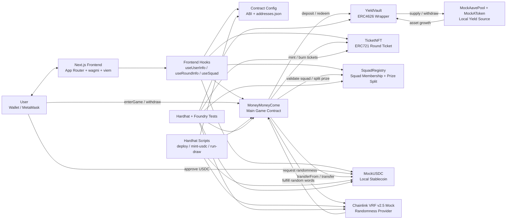
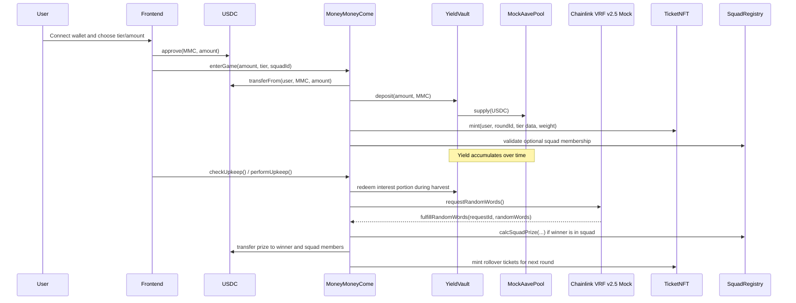
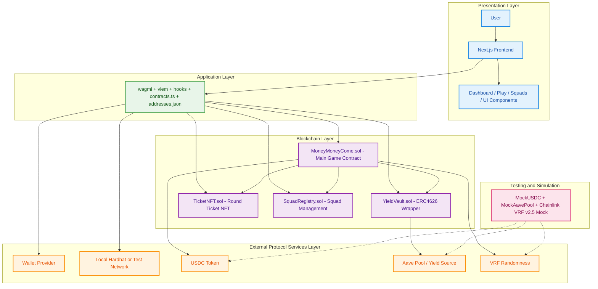

# MoneyMoneyCome Architecture

This document gives a high-level view of how the `money-money-come` project is structured and how data moves between the frontend, smart contracts, and local development helpers.

## System Overview



## Main Responsibilities

- `frontend/`: user interface, wallet connection, contract reads/writes, and display of rounds, deposits, squads, and withdrawals.
- `contracts/MoneyMoneyCome.sol`: core game logic for deposits, round lifecycle, yield harvesting, winner selection, and payouts.
- `contracts/YieldVault.sol`: vault layer that holds user funds and routes them into the Aave-like pool.
- `contracts/TicketNFT.sol`: NFT receipt for participation in a round.
- `contracts/SquadRegistry.sol`: team membership and squad payout calculation.
- `contracts/mocks/`: local-only mocks for USDC, Aave, and a wrapper around Chainlink's VRF v2.5 mock.
- `scripts/`: local development and demo helpers.
- `test/`: automated verification for the main protocol flow.

## Runtime Flow



## Folder Map

```text
money-money-come/
|- contracts/              Solidity contracts
|  |- MoneyMoneyCome.sol   Main protocol logic
|  |- YieldVault.sol       ERC4626 yield vault
|  |- TicketNFT.sol        Participation NFT
|  |- SquadRegistry.sol    Squad management and prize split
|  |- mocks/               Local mock dependencies
|- test/                   Hardhat TypeScript tests
|- scripts/                Local deploy and simulation scripts
|- frontend/               Next.js app
|  |- app/                 Pages
|  |- hooks/               Contract read/write hooks
|  |- lib/                 ABI, wagmi config, deployed addresses
|  |- components/          Reusable UI pieces
|- hardhat.config.ts       Backend toolchain config
|- README.md               Setup and local run guide
```

